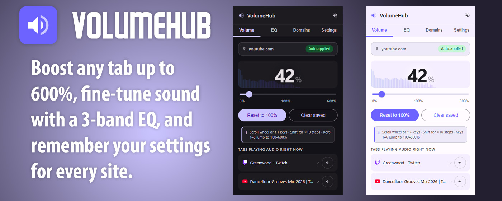



# VolumeHub

Boost any tab up to 600%, fine-tune sound with a 3-band EQ, and let VolumeHub remember your settings for every site.

## Features

**Volume**
- Boost any tab up to 600% volume
- Auto-saves your level for every site
- See and mute tabs playing audio in real time
- Live audio visualizer

**EQ**
- 3-band equalizer — bass, mid, and treble
- ±12 dB range per band
- One-click presets: Flat, Bass Boost, Vocal, Night Mode

**Domains**
- Every saved site volume in one place
- Remove individual sites or clear all at once

**Settings**
- Dark and light mode
- Set a default volume for new sites
- Auto-apply saved levels when you open the popup
- Export and import all settings as a backup

## Installation

### Chrome Web Store

[Install VolumeHub from the Chrome Web Store](https://chromewebstore.google.com/detail/volumehub/jdojcahmkfkdameooeogkcgjapofjlgi)

### From source

1. Clone or download this repository
2. Open Chrome and go to `chrome://extensions`
3. Enable **Developer mode** (top right)
4. Click **Load unpacked** and select the repo folder

## Privacy

VolumeHub stores all settings locally on your device using `chrome.storage.local`. No data is collected, transmitted, or shared. See the full [privacy policy](https://voiceofgrog.github.io/volumehub/docs/privacy.html).

## License

MIT — see [LICENSE](LICENSE)
